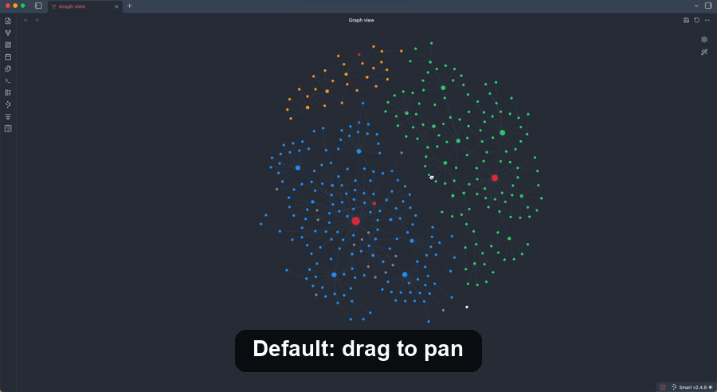

# Graph Scroll Pan

An Obsidian plugin that makes the **graph view** pan when you scroll, instead of zooming. Zooming is moved to **pinch** or **Cmd/Ctrl + scroll** — the same convention used by design and map apps. Built with trackpad users in mind.

## Why

By default, scrolling over the graph view zooms in and out, and panning requires click-and-dragging. If you prefer scrolling (or a two-finger trackpad swipe) to move around the graph — like in Figma or a maps app — this plugin swaps the behavior.

## Behavior

| Gesture | Action |
| --- | --- |
| Scroll / two-finger swipe | Pan (move the graph) |
| Pinch | Zoom in / out |
| Cmd/Ctrl + scroll | Zoom in / out |

On macOS, trackpad pinch gestures arrive as `Ctrl`-modified wheel events, so pinch-to-zoom works automatically. Zooming — pinch, `Cmd`/`Ctrl` + scroll, and the `+` / `−` buttons — is anchored to the center of the view, so the graph stays put instead of drifting toward the cursor.

Optional **`+` / `−` zoom buttons** are shown in the bottom-right corner of the graph for zooming without a gesture.

Works in both the global **Graph view** and the **Local graph** view.

## Settings

- **Pan speed** — multiplier for how far the graph moves per scroll (default `1.0`).
- **Invert horizontal** — flip the horizontal pan direction.
- **Invert vertical** — flip the vertical pan direction.
- **Show zoom buttons** — show the `+` / `−` buttons over the graph (default on).

## Installation

### From the Community Plugins browser

1. Open **Settings → Community plugins → Browse**.
2. Search for **Graph Scroll Pan**.
3. Install and enable it.

### Manual

1. Download `main.js`, `manifest.json`, and `styles.css` from the latest [release](../../releases).
2. Copy them into `<your vault>/.obsidian/plugins/graph-scroll-pan/`.
3. Reload Obsidian and enable the plugin in **Settings → Community plugins**.

## Notes

This plugin intercepts the graph view's wheel events and drives Obsidian's internal graph renderer to pan. It relies on internal renderer APIs that are not part of the public plugin API and may change in future Obsidian versions. It is desktop-only.

## License

[MIT](LICENSE)
